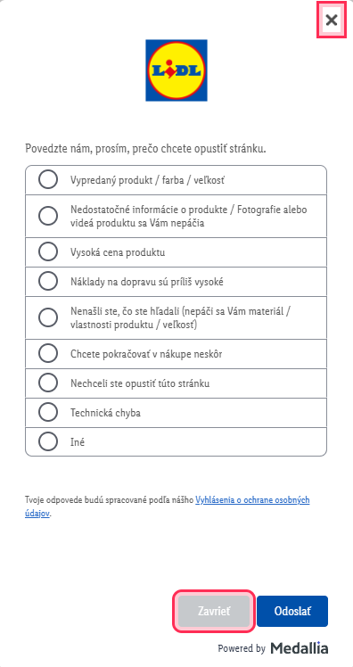

# Tsk!

**The world's least ambitious popup-related browser extension.**

Tsk! highlights likely close buttons on annoying popup dialogs.

That's it.

## Why?

Because apparently this was necessary.

Websites have become increasingly creative about where they put the way out
of a popup — tiny corner buttons, low-contrast controls, unfamiliar icons,
or dismissal buttons visually buried beside the action they would rather
you click.

Tsk! doesn't block popups or close anything automatically. It simply makes
likely ways out easier to spot and leaves the click to you.

## What it does

- Detects common popup and dialog patterns
- Highlights likely dismissal controls
- Handles dynamically added and initially hidden popups
- Works inside frames where browser extension access allows it
- Uses page structure and implementation clues rather than a dictionary of translated "Close" labels

Tsk! uses simple heuristics. It won't find every dismissal control on every
website.

That's fine.

## What it doesn't do

Tsk! does not:

- block popups
- automatically click anything
- hide page content
- maintain site-specific filter lists
- collect browsing data
- require an account or external service

It also never displays a popup of its own.

## How it works

Tsk! runs a small content script that looks for popup-like elements and
strongly identifiable dismissal controls.

Recognized popup context allows weaker clues to contribute to a match.
Controls with sufficiently strong clues can identify themselves without
popup context.

When Tsk! finds a likely dismissal control, it adds a visible outline.

No language model, computer vision, remote service, or translation database
is involved.

## Technology

- Manifest V3
- Vanilla JavaScript
- CSS

There is no framework, package manager, build system, backend, or runtime
dependency.

The contents of `src` are the extension.

## AI-assisted development

Tsk! was developed with AI assistance for implementation, testing ideas,
and iteration.

The behavior, scope, heuristics, product decisions, and real-world testing
were directed and reviewed by me. I do not claim that every line was
manually written or deeply reviewed.

The extension itself contains no AI functionality and does not communicate
with an AI service.

## Status

**0.1.0**

Tsk! is small by design. New detection rules are added when real-world use
shows that they are useful, rather than in pursuit of detecting every popup
on the web.

## License

See [LICENSE](LICENSE).